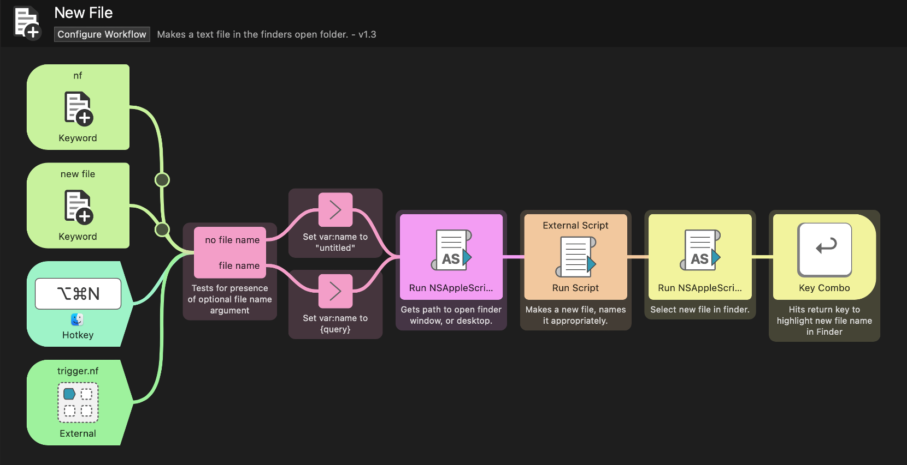

# New File - _Finder Style_

This is an [Alfred](Alhttps://www.alfredapp.comfred)  workflow that makes a new text file in the style of the Mac Finder.

__It works with three commands:__

1. > New File
2. > nf
3. ⌘ ⌥ N

These will each create a text file in the front most open folder or on the Finder desktop.

__It follows Finder rules.__

The default name of the file is “untitled”. 

__⌘ ⌥ N__ can not take a parameter so the file will be created, with it’s with name selected. Just start typing to change it.

__New File__ & __nf__ can take a name as an optional parameter. So `nf magnum opus.txt` will create a file name “magnum opus.txt” with the name selected minus the extension.

If you make a file with a name that is already in use in that folder the name will be appended with “ 2”, then “ 3” and so on. 

It respects your file extension while dealing with duplicates. So if  “magnum opus.txt” exists  then “magnum opus 2.txt” will be created.

Magnum Opus 2 will be -obviously I think- the title of my memoir.

Hint: Because the file is selected in the Finder __⌘↓__ will open the file in it’s default app.

